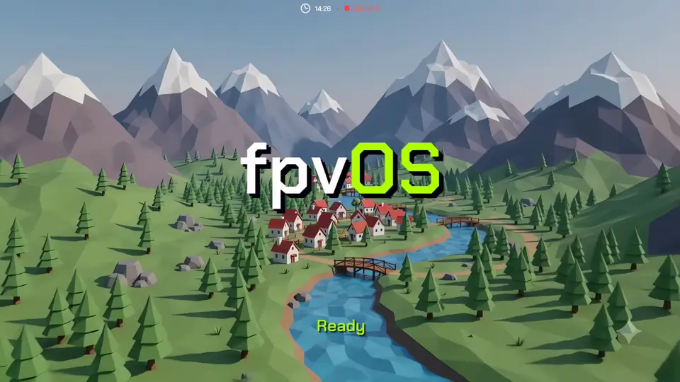
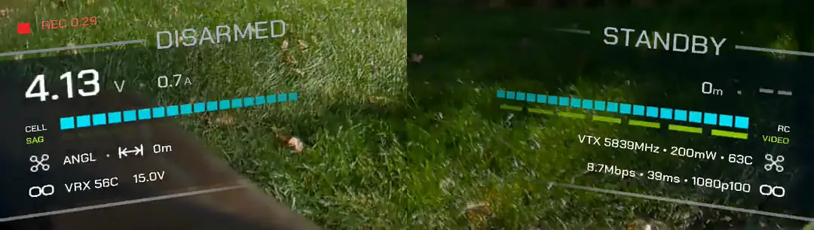

<div align="center">


### Open firmware for FPV VRX and VTX.

**The HUD, the video pipeline, the rf link — yours to change.**

[](https://discord.gg/kWZA5WcMZ)

[Compatibility](#compatibility) · [Quick start](#quick-start) · [Building](docs/BUILD.md) · [How it works](docs/ARCHITECTURE.md) · [Discord](https://discord.gg/kWZA5WcMZ) · [Contributing](#contributing)

`GPLv3` · `RK3568 / AR8030` · `status: alpha, flies today`

</div>

---

Digital FPV goggles ship as sealed appliances. The link, the on-screen display,
the recording, the menus — all frozen behind a vendor firmware you can't read,
can't fix, and can't extend. FPV outgrew that model years ago on every other
front: **Betaflight** opened the flight controller, **EdgeTX** opened the radio,
**ELRS** opened the control link. The goggle is the last closed box in the chain.

**fpvOS opens it.** It runs a full Linux userspace on the goggle and replaces
the stock application with **kestrel** — an open HUD and video engine using the Artosyn AR8030 digital link. Every pixel on screen, every frame decoded, every
menu is code you can hack, in a repo you can send a PR to.

This is the start. The goal is what Betaflight and EdgeTX became: a
community-owned platform that outlives any single product, and a place where a
good idea from anyone can end up on everyone's goggles.

**The focus is the experience, not the plumbing.** Open FPV so far has largely
been a story about connectivity and interoperability — bridging protocols,
getting one vendor's link to talk to another's, making hardware coexist. ELRS
and Betaflight changed how a quad flies and links, but the screen you stare at 
for the entire flight hasn't gotten the same attention.
fpvOS starts from that end: what you *see* in the goggles — how the HUD reads,
how the video feels, how recording and the menus behave. Because it renders on
a real GPU and owns the whole screen, an open goggle has a real shot at feeling
as good or *better* than a sealed, fully integrated system like an Antigravity A1 or a DJI
Camera Drone, by making the one thing you stare at the entire flight better than 
any locked firmware will ever bother to.

> **Try it risk-free.** The VRX Pro boots from the SD card, so the goggle's
> original firmware is never touched. Insert a flashed card to run fpvOS; pull
> it out to boot completely stock again. Nothing is flashed to the goggle, and
> there's nothing to un-brick — trying fpvOS is as reversible as ejecting a card.

## What works today

<div align="center">

<br><sub>Idle screen, then the canopy HUD sweeping in as the aircraft links up — recorded on the goggle with screen DVR.</sub>
</div>

kestrel flies now on real hardware against any stock Ascent compatible air unit:

- **AR8030 digital link** — association, telemetry, live link stats
- **H.264 / H.265 decode** on the Rockchip VPU, low-latency path
- **Canopy HUD** — a reactive attitude/instrument display driven from live OSD + link data
- **Themes** — five colour themes that re-hue the whole interface, switched live from the menu ([more below](#themes))
- **DVR** — onboard recording of the FPV feed or the screen experience.
- **On-screen menu** — camera, link, and display settings, driven from the goggle buttons
- **Betaflight OSD** overlay, standby/arm state detection, signal-lock and idle animations
- **Demo mode** — the whole HUD driven by a simulated flight, no aircraft needed
- **Wifi AP** share your live view with any spectator connected to the vrx wifi, play and manage your DVR recordings.

<div align="center">

<br><sub>The canopy's two panels as the quad arms: flight timer, cell voltage and sag, link and video tracks.</sub>
</div>

## Why this is different

Stock goggle firmware treats the display as a fixed overlay bolted onto a video
feed. This is an RK3568 — a quad-core SoC with a **Mali GPU**, a low latency hardware video
codec, and a DRM display pipeline. fpvOS uses all of it, and that changes what a
goggle *can be*:

- **The HUD is a real GPU scene, not a bitmap overlay.** kestrel renders the
  OSD in OpenGL ES on the Mali GPU and lets the display controller composite it
  over the hardware video plane at scan-out. That's what makes the canopy HUD's
  smooth animations, gradient rails, and signal-lock/warp transitions possible —
  and it leaves real headroom: shaders, depth, live gauges, effects a
  CPU-drawn overlay could never afford.
- **A reactive HUD that flies with the aircraft.** The canopy banks and shifts
  with attitude, live from the flight controller's OSD feed, with the
  reactivity dialable. The instrument moves with the horizon instead of sitting
  flat on the glass.
- **DVR done right — two ways.** *Raw* recording muxes the exact H.264/H.265
  bitstream off the link straight to MP4: a pixel-perfect capture of what the
  air unit sent, no re-encode, no quality loss, near-zero CPU. *Screen*
  recording uses the DRM writeback connector to composite every plane — video
  **and** your HUD — and encode that, so you capture exactly what you saw.
- **Everything the stock firmware does — and then some.** The goal is zero
  regressions: camera and image settings, link and channel control, power,
  recording, the on-goggle menus — all present, so switching costs you nothing
  and opens everything. Anything stock can do, fpvOS should do; everything
  after that is upside.
- **It doesn't have to stop at the goggle.** The same open approach reaches the
  **air unit** in the future — the VTX runs the same Artosyn baseband, and
  fpvOS could drive what it sends: resolution and mode, link parameters,
  power, the camera pipeline. An open ground *and* air stack means the whole
  video link becomes something the community tunes end to end, not a sealed
  pair.

The goggle has always had the horsepower for this. It was just locked up.

## Themes

A theme in fpvOS is not a tint laid over the HUD. The interface is built on
**colour roles** — every element on screen belongs to one — and a theme is a
palette for those roles:

| Role | What it colours |
|---|---|
| **text** | headline figures and row type |
| **data** | the measured tracks — cell level, link quality |
| **accent** | live state — armed rails, the sag track, VIDEO |
| **ground** | the panels the HUD is cut from |
| **quiet** | state words, track labels, anything qualifying a number |

A theme swaps the hues, never the meaning: a pilot who has learned the layout on
one theme reads every other one the same way. Each palette is checked against
the two backgrounds that actually occur in flight — bright sky and dark ground
in shadow — because everything is drawn over live video of unknown brightness.

| Theme | Character |
|---|---|
| **KESTREL** | The original: cyan instrumentation, lime for live state, a deep blue ground that lifts thin type off bright video |
| **EMBER** | Warm amber readings and a hotter orange for live state |
| **ICE** | Pale blue under a cyan accent — the quietest over bright sky, where lime can glare |
| **MONO** | No colour at all: state carried by brightness alone. The most legible over anything, and the accessible choice |
| **VIOLET** | Cold blue readings against a magenta live state — the widest hue separation, state unmistakable at a glance |

One theme dresses everything: the canopy HUD, the menus, the signal-lock screen
— and the web page, whose live view and DVR gallery pick up the goggle's theme
too. It switches live from **DISPLAY › Theme**, no restart, and is remembered
across boots.

**Want a theme?** Open a
[theme request](https://github.com/gehee/kestrel-gnd/issues/new?template=theme_request.md)
with a preview — a mockup, a screenshot you've recoloured, or just the five
colours — and vote for the ones you'd fly with (👍 on the issue). **The
highest-voted requests get implemented.**

## Compatibility

**Ground side:**

| Device | SoC | Link | Status |
|---|---|---|---|
| **Caddx Ascent VRX Pro** | Rockchip RK3568 | Artosyn AR8030 | ✅ **Supported — flies today** |

fpvOS links to the **Caddx Ascent Lite(+) air unit** for now. Same-silicon does not
mean same protocol — other vendors' AR8030 air units use their own link setup
and don't pair with this stack today.

One goggle and one air unit, fully working, is how this starts. More hardware
is exactly the kind of thing a growing community brings — if you have other
AR8030-class gear, [come talk to us on Discord](https://discord.gg/kWZA5WcMZ).

## Before you fly

fpvOS is **alpha** software, and it runs the video link you fly by. Treat it
that way:

- **A freeze or a dropout mid-flight can cost you the aircraft, or worse.**
  Bench-test it, then fly line-of-sight or over open ground until you trust it
  on your setup.
- **RF compliance is your responsibility.** kestrel can change transmit power,
  channel, and bandwidth, and what is legal depends on where you fly. Check
  your country's rules for 5 GHz video transmitters, and hold whatever licence
  they require.
- **The WiFi access point is 2.4 GHz.** It's off by default. Switched on, it
  puts a 2.4 GHz transmitter on your head, next to a 2.4 GHz RC link like
  ELRS. Range-test your control link with it on before you fly that way.
- **No warranty.** fpvOS is provided as is, without warranty of any kind — see
  sections 15 and 16 of the [GPLv3](LICENSE). You use it at your own risk.

## Quick start

```sh
# Build on a Linux host (tested on Ubuntu 24.04). Install the build
# dependencies first — see docs/BUILD.md#dependencies
# (Debian/Ubuntu one-liner + the one Python package).

# Buildroot comes down with the repo (it's a pinned submodule):
git clone --recurse-submodules https://github.com/gehee/fpvOS && cd fpvOS

# Download the vendor blobs.
scripts/extract-vendor.py

# Build the rootfs and assemble the flashable card:
./build.sh
```

Out comes `sdcard.img.xz` (and the raw `sdcard.img`). Flash it with
[balenaEtcher](https://etcher.balena.io/), boot it, fly.

Full walkthrough — flashing, recovery, first boot, the boot-chain details —
lives in **[docs/BUILD.md](docs/BUILD.md)** and **[docs/INSTALL.md](docs/INSTALL.md)**.

## Why bring-your-own-firmware

The AR8030 baseband stack is proprietary. fpvOS is built *around* it, cleanly:
not one line of vendor code lives in this repo, and the interface to it is
declared from observed behavior in kestrel's
[`artosyn/bb_client.h`](https://github.com/gehee/kestrel-gnd/blob/main/artosyn/bb_client.h),
not copied from an SDK. That keeps the project legally clean, keeps *your*
firmware *yours*, and means everything here is genuinely free software you can
read end to end.

## Repository layout

This repo builds the image. The ground application itself, **kestrel**, lives
in its own repo ([`gehee/kestrel-gnd`](https://github.com/gehee/kestrel-gnd))
and is pulled in as a Buildroot package.

| Path | What |
|---|---|
| [`br-external/`](br-external/) | Buildroot external tree: defconfig, the kestrel package (fetches kestrel), rootfs overlay |
| [`boot/`](boot/) | SD-image assembly and the boot-chain recipes |
| [`scripts/`](scripts/) | `extract-vendor.py` — fetches vendor blobs from your own firmware |
| [`docs/`](docs/) | Build, install, and architecture guides |

## For manufacturers

Building a goggle around the **Artosyn AR8030**? Put fpvOS on it and ship with
a finished, evolving pilot experience instead of writing one: GPU-rendered
reactive HUD, low-latency H.264/H.265 decode, raw and screen DVR, the full
menu system, themes — and a community that keeps improving all of it. You keep
the hardware, the RF front-end tuning, and the brand.

It runs on **Rockchip RK3568**: H.264/H.265 decode on the hardware VPU, with
decoded frames handed to the display as DMA-BUFs and scanned out without a
copy — the foundation of a low glass-to-glass latency pipeline. As a licensed
Artosyn customer with your own Rockchip BSP, integration is a Buildroot board
directory: your defconfig, your bring-up script, your baseband config, your
button map. No blob extraction, no loader tricks.

## Contributing

This is a young project with a big target, which is the best time to join. Good
first ground to break:

- **New hardware** — another AR8030 goggle you can get a shell on
- **HUD & UX** — it's all open; make the FPV overlay you always wanted
- **Themes** — [request one](https://github.com/gehee/kestrel-gnd/issues/new?template=theme_request.md) with a preview, or vote on the others; the most-voted get built
- **Video pipeline** — latency, codecs, the decode path
- **Docs** — clear build, flash, and HUD docs save the next person days

Open an issue to say hi, or a PR to dive in. See [CONTRIBUTING.md](CONTRIBUTING.md).

## Thank you

To **Artosyn**, for the AR8030 — a digital video link good enough that the
hardware was never the limit, only the software around it. And to **Caddx**,
for building the VRX Pro and the air units around it, and for publishing their
firmware for anyone to download. fpvOS stands on both, and wouldn't exist
without such great systems to build on.

## License

**GPLv3** for all code — the same copyleft Betaflight, EdgeTX, iNav, and ELRS
chose, so improvements flow back to everyone. Bundled fonts keep their own
licenses, shipped next to them: Chakra Petch under the SIL OFL, DejaVu under
the Bitstream Vera license. The idle-screen background
(`etc/kestrel/background.png` and `background.mp4` in the rootfs overlay) was
generated for fpvOS with Google Gemini; it contains no third-party footage and
ships under the same terms as the rest of the repository. The proprietary
blobs `extract-vendor.py` fetches are **not** covered by this license.

<div align="center">

**fpvOS** — the goggle is open now.

</div>
